# Bianca — Family Assistant: Architecture

## Overview

Bianca is a family assistant that runs entirely on local hardware. It handles day-to-day task and event management, acts as a household knowledge base powered by a local LLM with web search, sends proactive reminders via WhatsApp, and runs a production-grade real-time home surveillance pipeline.

**Key characteristics:**
- All AI runs locally on GPU — no cloud AI services, no subscriptions
- Video decoding and ML inference happen entirely on the GPU (CPU never touches video frames)
- Surveillance alerts are defined in plain English — no retraining required
- Five Docker containers on one machine, managed by Docker Compose

The stack is built on five GPU-capable containers:

| Container | Role | GPU | Key tech |
|---|---|---|---|
| `bianca-app` | FastAPI app, all routes, browser UI | No (CPU-only) | FastAPI, uvicorn, Jinja2 |
| `bianca-whisper` | Speech-to-text | Yes | faster-whisper large-v3 |
| `bianca-deepstream` | Video ingest + frame broadcast | Yes | DeepStream 7.0, GStreamer NVDEC |
| `bianca-triton` | Object detection inference | Yes | Triton 25.03, YOLO-World M TRT |
| `bianca-ollama` | LLM for NLU and generation | Yes | Ollama, Qwen 2.5:14b |

Inter-container communication:

```
Browser/Twilio ──HTTPS──► app:8000 ──HTTP──► whisper:8080      (STT)
                                    ──HTTP──► deepstream:8090   (video frames + events)
                                    ──HTTP──► ollama:11434      (LLM)
                                    ──HTTP──► triton:8002       (Triton model management)
                                    ──HTTP──► triton:8004       (TRT re-export trigger)
                    deepstream:8090 ──HTTP──► triton:8002       (YOLO inference)
```

---

## Technology Stack

| Layer | Technology | Why |
|---|---|---|
| Phone calls | Twilio (inbound PSTN) | Handles carrier complexity, webhooks, TTS |
| Phone TTS | AWS Polly via Twilio (`Polly.Joanna`) | Natural voice, no extra integration |
| Browser mic + VAD | `@ricky0123/vad-web` (Silero VAD, ONNX Runtime Web) | ML-based voice detection, runs on device, no tap needed |
| Browser TTS | `speechSynthesis` API | Built-in, no server round-trip |
| Speech-to-text | faster-whisper `large-v3` on CUDA | Free, accurate, used for both phone and browser |
| LLM | Qwen 2.5:14b via Ollama | Strong reasoning, runs fully locally |
| Web search | Tavily API | Clean results API, image search support |
| Messaging | Twilio WhatsApp API | Async research + reminder delivery |
| Storage | Markdown file (`family.md`) | Human-readable, editable, no DB setup |
| File locking | `filelock` | Prevents concurrent write corruption |
| Video ingest | DeepStream 7.0 — `pipeline_worker.py` subprocess: rtspsrc → nvv4l2decoder → nvvideoconvert → nvjpegenc → appsink | 100% NVDEC GPU decode; frame stays in NVMM until final JPEG bytes; subprocess isolation avoids asyncio↔rtspsrc SIGABRT |
| Scene detection | YOLO-World M TRT via Triton 25.03 | Open-vocabulary detection; 8ms median @ 1280×720; queries updated without TRT re-export |
| Object tracking | `_SimpleTracker` (pure-numpy IoU) | Persistent track IDs, deduplication; CPU-only; no pybind11/supervision |
| Inference serving | NVIDIA Triton Inference Server 25.03 (Python backend + TRT) | Model management API enables live query swaps; HTTP :8002 for inference + model control |
| Scheduler | APScheduler `AsyncIOScheduler` | Proactive reminders without Celery/Redis |
| Backend | FastAPI + uvicorn | Async, fast, minimal boilerplate |
| Templates | Jinja2 + Bootstrap 5 | No build step, zero JS framework needed |
| Logging | `TimedRotatingFileHandler` | Daily log files, 7-day retention |
| Tunnel (dev) | Cloudflare Tunnel (`cloudflared`) | Twilio webhooks + HTTPS for browser mic; no bandwidth limits |

---

## GPU Memory Layout (RTX 4070 Ti Super — 16GB)

| Allocation | Size | Notes |
|---|---|---|
| Qwen 2.5:14b Q4_K_M (Ollama) | ~9–10 GB | Always hot; loaded at startup |
| Whisper large-v3 int8_float16 | ~1.5 GB | Always loaded; not active during Qwen inference |
| YOLO-World M TRT engine (Triton) | ~0.3 GB | Loaded at triton startup; persistent |
| DeepStream pipeline buffers | ~0.3 GB | Per-camera nvv4l2decoder + NVMM buffers; scales with camera count |
| **Steady-state total** | **~12.3 GB** | ~3.7 GB headroom |

Note: Whisper and Qwen never run at the same time. TRT re-export (if needed) peaks at ~4GB extra — do not trigger while Qwen is running a long generation.

---

## Docker Compose Architecture

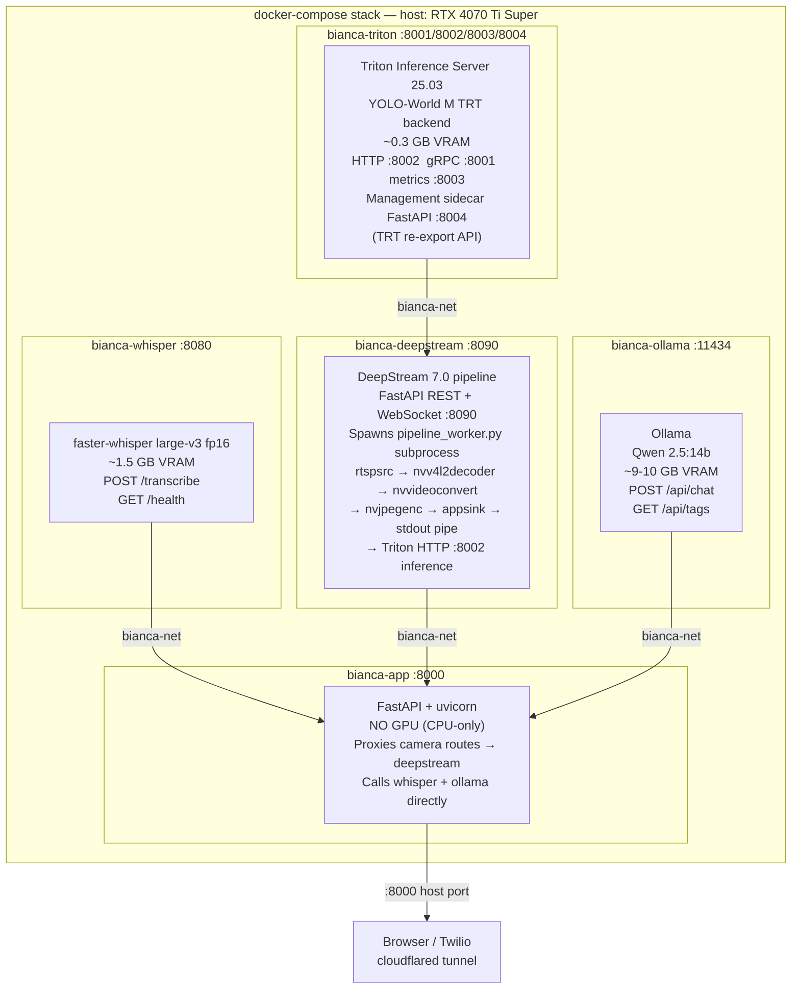

### Container responsibilities

| Container | Image | GPU | Purpose |
|---|---|---|---|
| `bianca-whisper` | `bianca-whisper` (Dockerfile.whisper) | Yes | faster-whisper STT; exposes REST `/transcribe` |
| `bianca-triton` | `bianca-triton` (Dockerfile.triton) | Yes | Triton 25.03 + YOLO-World M TRT; HTTP :8002, gRPC :8001; management sidecar FastAPI :8004 (TRT re-export) |
| `bianca-deepstream` | `bianca-deepstream` (Dockerfile.deepstream) | Yes | DeepStream 7.0 NVDEC pipeline; FastAPI REST + WS :8090 |
| `bianca-ollama` | `ollama/ollama:latest` | Yes | Qwen 2.5:14b LLM; entrypoint auto-pulls model |
| `bianca-app` | `bianca-app` (Dockerfile.app) | **No** | Main FastAPI app; explicitly CUDA-free; proxies camera routes |

### Key Docker Compose design decisions

- **App has no GPU reservation** — enforces CUDA-free constraint; any accidental PyTorch/CUDA import fails fast
- **All five on one bridge network** (`bianca-net`) — containers reach each other by service name
- **`depends_on` with `service_healthy`** — deepstream waits for triton; app waits for deepstream + whisper + ollama
- **Bind-mounts for AI weights** — `~/.cache/huggingface` into whisper; `./models` into triton and deepstream; weights downloaded once to host
- **Named volume for Ollama models** (`ollama-models`) — `qwen2.5:14b` (~9GB) persists across restarts
- **App proxies camera routes** — `main.py` forwards `/cameras/*` to `deepstream:8090` via httpx; app container never imports GStreamer or DeepStream

---

## System Architecture

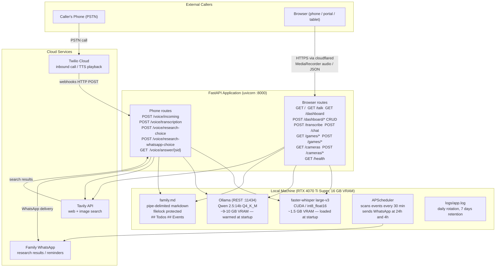

---

## Call Flow Detail

### Flow 1 — Greeting & Speech Capture

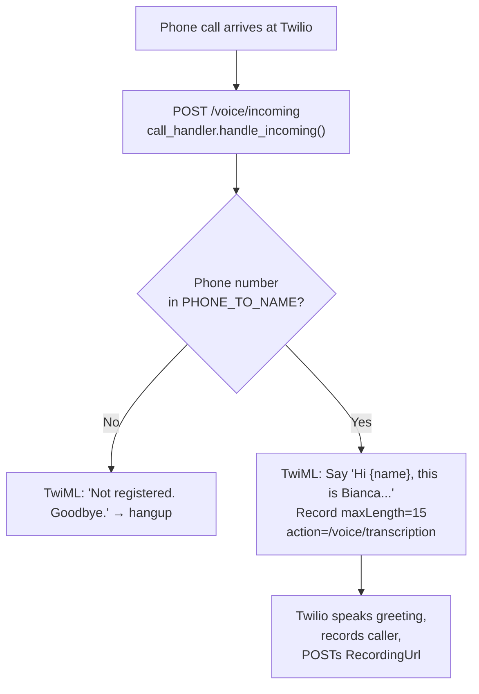

### Flow 2 — Transcription & Intent Routing (Filler + Async)

The transcription route returns a filler phrase **immediately** and computes the answer in parallel, eliminating perceived silence.

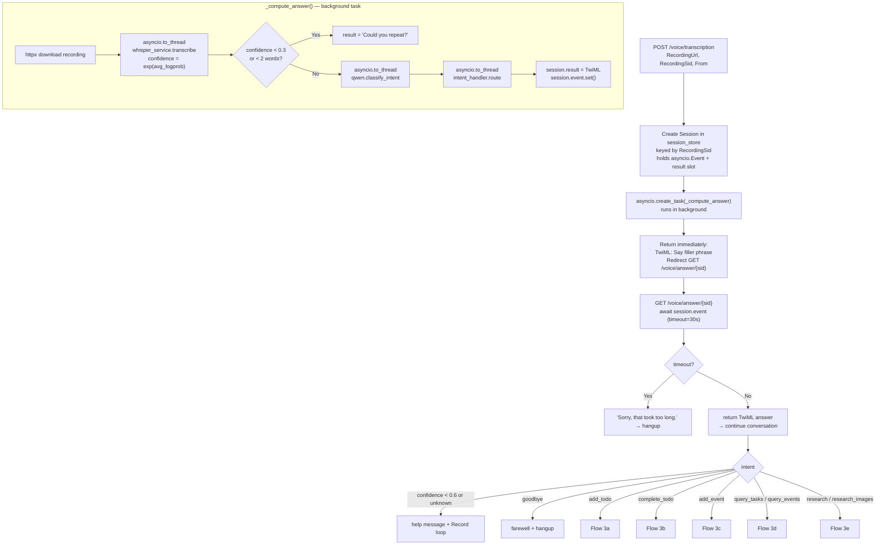

**New component:** `services/session_store.py` — thin dict-based store mapping `RecordingSid → Session(event, result)`.

### Flow 3a — Add Todo

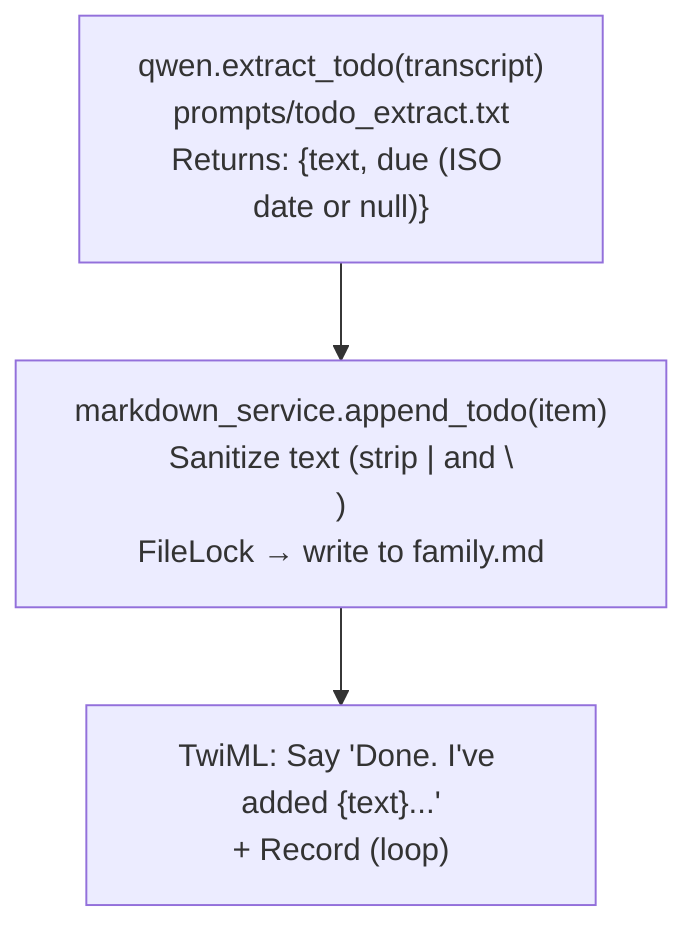

### Flow 3b — Complete Todo

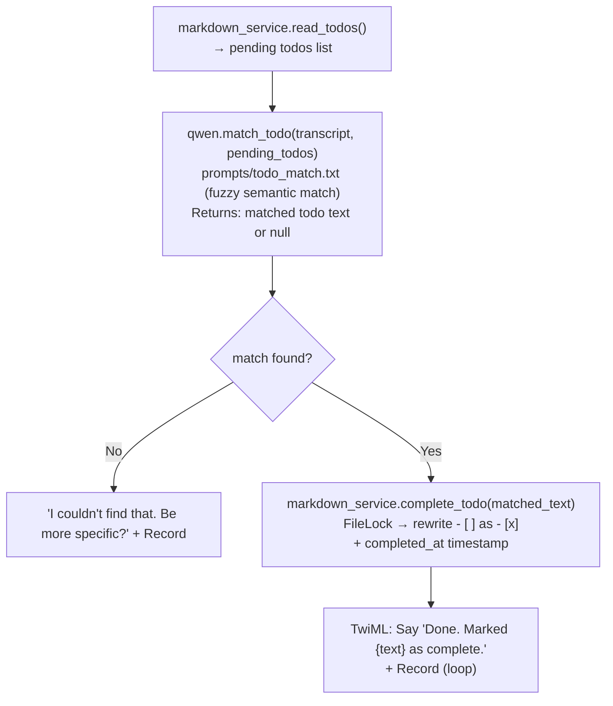

### Flow 3c — Add Event

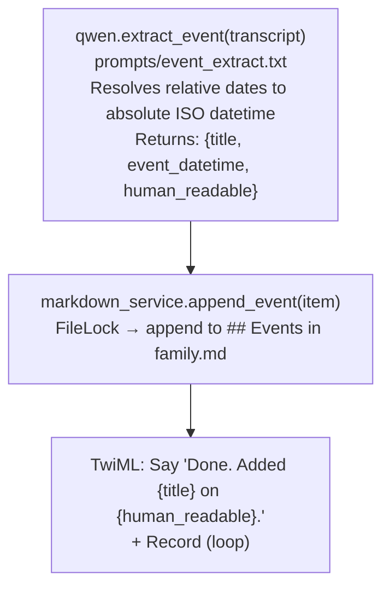

### Flow 3d — Query Todos / Events

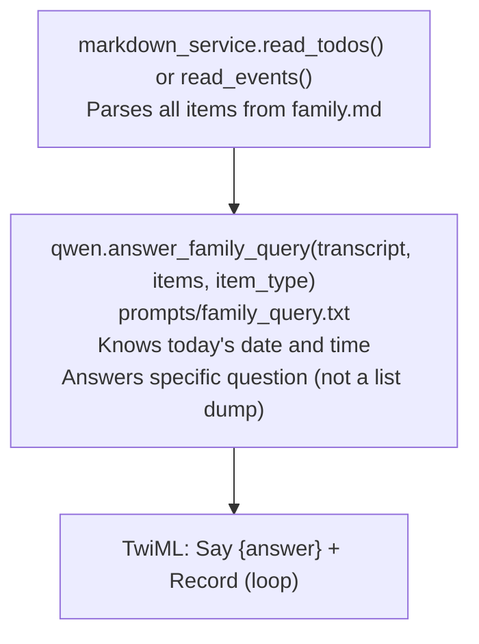

### Flow 3e — Research

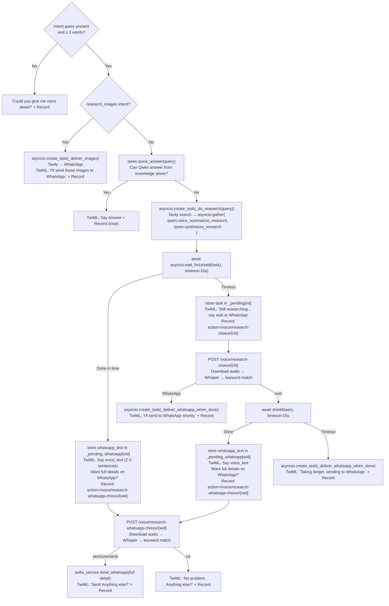

---

## Proactive Reminders

A background scheduler (`APScheduler AsyncIOScheduler`) starts at app startup and scans `family.md` every 30 minutes for upcoming events.

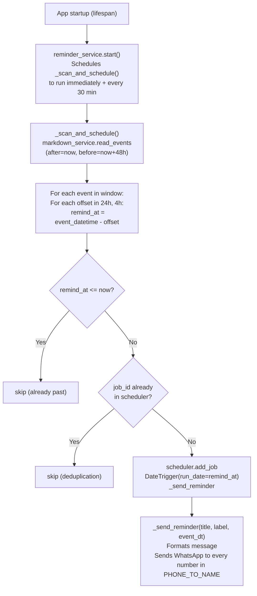

**Deduplication:** APScheduler job IDs are deterministic (`reminder_{iso_datetime}_{minutes}`). The 30-minute scan simply skips any job ID that already exists. One-off jobs are removed by APScheduler after they fire, so there is no risk of double-sending within a single server run.

**Restart behaviour:** The in-memory job store is cleared on restart. The scanner runs immediately on startup and reschedules any reminders whose `remind_at` is still in the future. Reminders already sent (whose `remind_at` is in the past) are naturally skipped by the `remind_at <= now` guard.

---

## Web Dashboard Flow

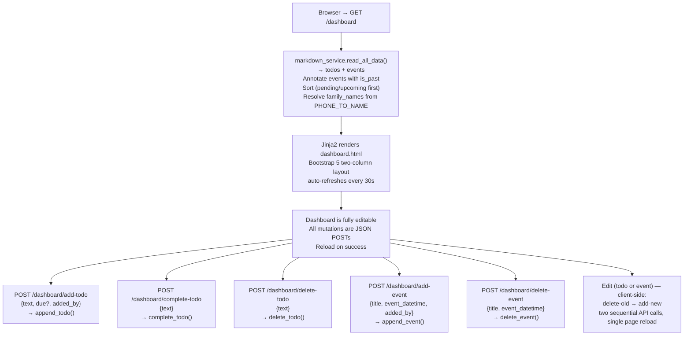

---

## Browser Interface Flow

Family members open the browser interface on any device on the local network. The Talk and Hangman pages require HTTPS (use the cloudflared URL) because mic access and WASM require a secure context.

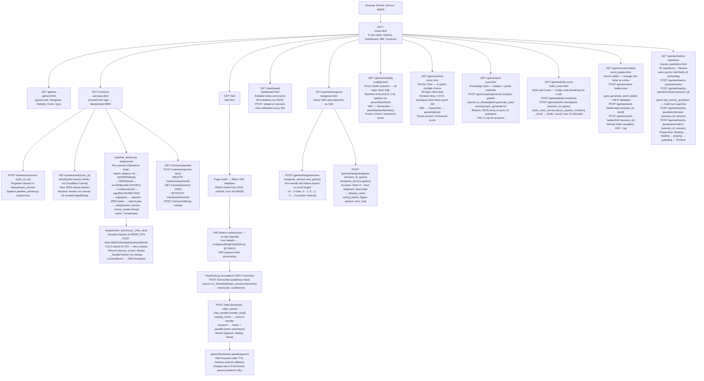

---

## Component Map

```
family-assistant/
│
├── main.py                    FastAPI app, all routes, startup warmup, log setup
├── config.py                  Pydantic settings, .env loading, phone→name map
├── family.md                  Shared storage: todos + events (pipe-delimited markdown)
├── logs/                      Daily rotating logs (app.log, 7 days retention)
│
├── handlers/
│   ├── call_handler.py        Twilio webhooks → download audio → Whisper → classify
│   ├── chat_handler.py        Browser /chat → classify → route → return {speech, display}
│   ├── intent_handler.py      Routes IntentResult to correct sub-handler (phone path)
│   ├── todo_handler.py        add_todo, query_todos, complete_todo
│   ├── event_handler.py       add_event, query_events
│   ├── research_handler.py    quick_answer → Tavily → parallel voice+WhatsApp summaries
│   └── response_handler.py    TwiML builders: voice_gather, voice_say_then_gather, etc.
│
├── services/
│   ├── deepstream_service.py  FastAPI :8090; spawns pipeline_worker.py subprocess per stream set; _frame_reader reads JPEG frames from stdout pipe; broadcasts via WebSocket; Triton YOLO-World inference; query + event management
│   ├── pipeline_worker.py     Standalone GStreamer subprocess — isolates rtspsrc from asyncio; per-camera chain: rtspsrc→nvv4l2decoder→nvvideoconvert→nvjpegenc→appsink; JPEG frames sent over stdout length-prefixed wire protocol
│   ├── whisper_service.py     faster-whisper large-v3 CUDA, suffix param for webm/wav
│   ├── qwen.py                Ollama REST wrapper, all LLM calls, JSON extraction
│   ├── markdown_service.py    Read/write/parse/delete family.md with FileLock
│   ├── session_store.py       In-memory sessions (RecordingSid → asyncio.Event + result)
│   ├── tavily_service.py      Tavily web + image search with retry
│   ├── twilio_service.py      WhatsApp message + image sender
│   ├── reminder_service.py    APScheduler — 24h/4h WhatsApp reminders for events
│   ├── hangman_service.py     Hangman game state, word list, guess logic
│   ├── bulls_cows_service.py  Bulls and Cows game state, secret generation, spoken-digit parser
│   ├── word_ladder_service.py BFS-validated word ladder puzzles; /usr/share/dict/words word set
│   └── twenty_questions_service.py  20Q multi-turn Qwen session, phase management, answer normalisation
│
├── models/
│   └── schemas.py             Pydantic models: IntentResult, TodoItem, EventItem
│
├── prompts/
│   ├── intent_classify.txt    Few-shot intent classifier (9 intents)
│   ├── todo_extract.txt       Extract todo text + due date from transcript
│   ├── todo_match.txt         Fuzzy-match transcript to existing todo
│   ├── event_extract.txt      Extract event title + datetime from transcript
│   ├── family_query.txt       Answer natural language questions about todos/events
│   ├── quick_answer.txt       Decide if Qwen can answer from knowledge vs web search
│   ├── research_voice.txt     2-3 sentence spoken summary of search results
│   ├── research_synthesize.txt  Full Markdown summary for WhatsApp / browser display
│   └── quiz_generate.txt      Generate 10 kid-safe MCQ questions for subject + grade
│
└── templates/
    ├── home.html              Landing page — 4 nav cards: Games, Dashboard, Talk, Cameras
    ├── games.html             Games hub — links to all 7 games
    ├── cameras.html           RTSP stream viewer — URL form + live MJPEG feed + AI event placeholder
    ├── talk.html              Browser voice interface — Silero VAD + Whisper STT, no tap needed
    ├── hangman.html           Voice hangman — VAD, hint letters pre-revealed at start
    ├── multiply.html          Times Tables game — VAD, spoken number parsing, score tracking
    ├── clock.html             Tell the Time game — SVG clocks, 4-option MCQ, VAD
    ├── quiz.html              Knowledge Quiz — subject/grade setup, Qwen questions, VAD
    ├── bulls_cows.html        Bulls and Cows — history table, spoken digit VAD
    ├── word_ladder.html       Word Ladder — vertical chain visualiser, BFS hints, VAD
    ├── twenty_questions.html  20 Questions — 4-phase UI, multi-turn Qwen yes/no VAD
    └── dashboard.html         Editable family dashboard — Bootstrap 5, vanilla JS
```

---

## Data Schema (family.md)

```markdown
# Family Assistant

## Todos

- [ ] Buy groceries | due: 2026-04-03 | added_by: Alice | added_at: 2026-03-29T10:15:00
- [x] Renew passport | due: none | added_by: Bob | added_at: 2026-03-20T09:00:00 | completed_at: 2026-03-25T12:00:00

## Events

- 2026-04-10T14:00:00 | Dentist appointment | added_by: Alice | added_at: 2026-03-29T10:20:00
- 2026-05-01T00:00:00 | Family vacation starts | added_by: Bob | added_at: 2026-03-01T08:00:00
```

**Rules:**
- Todos: `- [ ]` pending, `- [x]` complete. Fields pipe-delimited. Text must not contain `|` (sanitized on write).
- Events: ISO datetime first field, then title + metadata. Sorted by insertion order.
- File is protected by `filelock` — one writer at a time, 5-second timeout.

---

## Key Design Decisions

| Decision | Rationale |
|---|---|
| `<Record>` + Whisper instead of `<Gather input="speech">` | Free, more accurate STT especially for names and natural speech |
| Two Qwen calls per request (classify → extract) | More reliable than one combined call; smaller focused prompts |
| `quick_answer` check before Tavily | Avoids paid API call for simple knowledge questions |
| FastAPI `BackgroundTasks` for research | No Redis/Celery needed; delivers WhatsApp while call is already ended |
| Markdown file instead of database | Human-readable, manually editable, zero infrastructure |
| `filelock` for writes | Prevents corruption from rare concurrent calls; family-scale volume is fine |
| Whisper loaded at startup | Eliminates cold-start delay on first call |
| Qwen warmed up at startup via dummy `_chat("hi")` | Ollama lazy-loads model; warmup ensures GPU is ready |
| Few-shot examples in intent classifier | Significantly reduces misclassifications vs zero-shot |
| DeepStream → Triton via HTTP not gRPC | gRPC TYPE_STRING/pybind11 crash in tritonserver ≤24.09; UINT8+FP32 inputs mean gRPC could work on 25.03, but HTTP is simpler to debug (curl, browser) and required anyway for the model management API (`/v2/repository/models/yoloworld/load`); at 10fps with ~8ms GPU inference the ~0.9ms HTTP overhead is negligible; gRPC worth revisiting only at 10+ cameras |
| TRT inference always; query changes trigger full re-export via management sidecar | TRT bakes CLIP text embeddings at export time — changing queries without re-exporting fires the engine on old class slots but maps to new labels (silent wrong results). PyTorch fallback is not used after initial engine creation; instead the management sidecar (`triton:8004`) re-exports a new TRT engine (~90s) in the background. The old engine keeps running until the new one is ready. |
| App-level cross-service orchestration for query changes | When the user changes detection queries, `main.py` owns the full lifecycle: (1) pause Qwen (`keep_alive=0` so VRAM is freed), (2) trigger TRT re-export via `POST triton:8004/reexport`, (3) poll status every 3s up to 180s, (4) reload Triton model via `triton:8002` management API, (5) commit updated queries to deepstream via `POST deepstream:8090/queries/commit`, (6) resume Qwen. During re-export all LLM routes return HTTP 503. `deepstream_service` has no knowledge of Ollama. |
| GStreamer subprocess isolation for RTSP | asyncio's epoll races with rtspsrc's GLib socket watcher in the same process → SIGABRT. Spawning `pipeline_worker.py` as a subprocess removes the interference entirely. All GLib/GStreamer code lives only in the subprocess. |
| `import cv2` must come after `Gst.init()` | cv2 (CUDA build) initialises NVIDIA codec libs on import, conflicting with DeepStream's CUDA init inside Gst.init(). Importing cv2 before Gst.init() → SIGABRT. Solution: remove cv2 from pipeline_worker.py entirely — use GStreamer's `nvjpegenc` for JPEG encoding instead. |
| Per-camera chains instead of nvstreammux+tiler | nvstreammux batches streams for nvinfer — unnecessary for display-only pipelines. Per-camera chains (each with its own nvv4l2decoder→nvvideoconvert→nvjpegenc→appsink) are simpler, remove the nvmultistreamtiler, and scale independently. nvstreammux is only needed when running nvinfer on the pipeline output. |
| nvjpegenc over jpegenc | nvjpegenc accepts `video/x-raw(memory:NVMM)` — the frame stays in GPU memory through encode. jpegenc (CPU) requires a GPU→CPU copy first. On an RTX 4070 Ti Super the difference is measurable in frame latency at 25fps. |

---

## pipeline_worker.py — IPC Protocol

`deepstream_service.py` spawns `pipeline_worker.py` as a subprocess with `stdout=PIPE, stdin=PIPE`.

**stdout (pipeline_worker → parent) — binary, big-endian:**
```
Normal frame:
  [4 bytes]  cam_id UTF-8 byte length
  [N bytes]  cam_id string
  [4 bytes]  JPEG byte length
  [M bytes]  JPEG data

EOS / shutdown signal:
  [4 bytes = 0x00000000]   (cam_id length of zero)
```

**stdin (parent → pipeline_worker) — text lines:**
```
"STOP\n"  →  graceful shutdown (pipeline.set_state(NULL), send EOS, exit)
```

**Pipeline topology per camera:**
```
RTSP:  rtspsrc (latency=0) → rtph264/5depay → h264/5parse → nvv4l2decoder
             → nvvideoconvert → capsfilter(video/x-raw(memory:NVMM),format=I420)
             → nvjpegenc → appsink

File:  uridecodebin → nvvideoconvert → capsfilter(video/x-raw(memory:NVMM),format=I420)
             → nvjpegenc → appsink
```

Key properties: `appsink` has `emit-signals=True`, `max-buffers=2`, `drop=True`, `sync=False`. The `new-sample` callback throttles to `DISPLAY_FPS` (default 25) using a monotonic timestamp check; excess frames are drained (pull-sample without sending) to keep the 2-slot buffer free.

---

## Testing RTSP Streams Locally (mediamtx + ffmpeg)

Use this to test the camera pipeline without a real IP camera.

### 1. Run the mediamtx RTSP server

mediamtx is already in `docker-compose.yml` (if added) or run it standalone:

```bash
docker run --rm -d \
  --name mediamtx \
  --network family-assistant_bianca-net \
  -p 8554:8554 \
  -p 1935:1935 \
  bluenviron/mediamtx:latest
```

mediamtx auto-accepts any published stream — no config needed.

### 2. Publish a local video file as an RTSP stream

```bash
ffmpeg -re \
  -stream_loop -1 \
  -i /path/to/your/video.mp4 \
  -c:v libx264 \
  -preset veryfast \
  -tune zerolatency \
  -rtsp_transport tcp \
  -f rtsp \
  rtsp://localhost:8554/cam1
```

Flags explained:
- `-re` — read at native speed (real-time, not as fast as possible)
- `-stream_loop -1` — loop the file indefinitely
- `-c:v libx264 -preset veryfast -tune zerolatency` — fast H.264 encode, minimal buffering
- `-rtsp_transport tcp` — use TCP (required if mediamtx UDP ports 8000/8001 are not exposed)
- `rtsp://localhost:8554/cam1` — publish to mediamtx on host; use `rtsp://mediamtx:8554/cam1` from inside containers

### 3. Register the stream with deepstream

```bash
curl -s -X POST http://localhost:8090/streams \
  -H "Content-Type: application/json" \
  -d '{"cam_id": "cam0", "uri": "rtsp://mediamtx:8554/cam1"}'
```

`uri` uses the container hostname `mediamtx` because deepstream_service runs inside Docker.

### 4. Watch logs

```bash
docker logs -f bianca-deepstream 2>&1 | grep -v "^0:"
```

Expected on success:
```
[pipeline_worker] INFO Pipeline started: 1 camera(s) ['cam0']
[pipeline_worker] INFO cam0 downstream chain ready (nvvideoconvert→nvjpegenc→appsink)
```

### 5. Remove the stream

```bash
curl -s -X DELETE http://localhost:8090/streams/cam0
```
