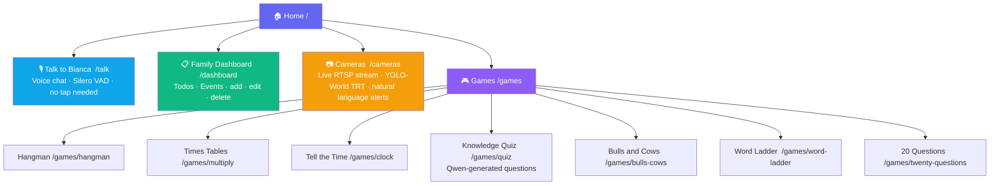
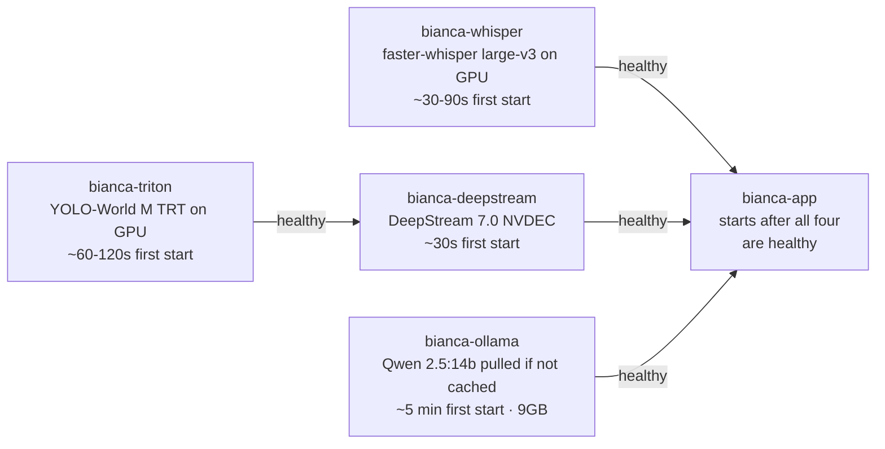

# Bianca — Family Assistant

Bianca is a family assistant that runs entirely on local hardware — no cloud AI, no subscriptions. It handles day-to-day task and event management, acts as a household knowledge base powered by a local LLM with web search, sends proactive reminders via WhatsApp, and runs a production-grade real-time home surveillance pipeline. Video is decoded and processed entirely on the GPU — from RTSP ingest through object detection — using NVIDIA DeepStream for hardware-accelerated NVDEC decoding and NVIDIA Triton Inference Server serving a YOLO-World TRT engine, so the CPU is never involved in the video path. Surveillance alerts are defined in plain English: type a query like "person near the gate" or "child in the garden"; Bianca re-exports the YOLO-World TRT engine with the new text embeddings (~90s, Qwen temporarily paused to free VRAM) and starts alerting on it — no retraining required.

**Full architecture and call flow:** see [`ARCHITECTURE.md`](ARCHITECTURE.md)

---

## UI



---

## What it does

**Via phone call (Twilio):**
- **Add todos** — "Add a todo to buy milk"
- **Complete todos** — "Mark buy milk as done"
- **Add events** — "Add dentist appointment next Tuesday at 2pm"
- **Query family data** — "What events do we have this week?"
- **Research** — Short spoken answer, full details sent to WhatsApp on request
- **Image search** — Results sent to WhatsApp

**Via browser (any device on your network):**
- **Talk to Bianca** — same features as phone; mic auto-detects your voice (no tap needed) using Silero VAD running locally in the browser
- **Family Dashboard** — view, add, edit, and delete todos and events
- **Hangman** — voice-controlled word game for kids; just speak your guess, no tap required
- **Times Tables** — voice multiplication practice; Bianca asks, kid answers out loud
- **Tell the Time** — 4-option clock reading game with pure SVG clock faces
- **Knowledge Quiz** — pick a subject and grade; Qwen generates 10 tailored questions on the fly
- **Bulls and Cows** — crack Bianca's secret 4-digit code; say each digit aloud; bulls = right digit right place, cows = right digit wrong place
- **Word Ladder** — change one letter at a time to climb from the start word to the target; BFS-powered hints; Qwen generates kid-friendly puzzles
- **20 Questions** — think of an animal, food, object, or place; Bianca asks up to 20 yes/no questions and tries to guess it using Qwen
- **Cameras** — live view of RTSP streams or local video files via DeepStream NVDEC hardware decode; YOLO-World M TRT engine on Triton Inference Server detects objects matching user-defined natural-language queries (e.g. "small child", "person in red", "cat on sofa") at ~8ms per frame; _SimpleTracker assigns persistent track IDs; matched events logged in real time; changing queries triggers a ~90s TRT re-export (Qwen temporarily paused to free VRAM) after which the new classes are active

**Proactive:**
- **Event reminders** — WhatsApp reminders sent to all family members 24h and 4h before events

---

## Prerequisites

### Accounts and API keys

| Service | Purpose | Free tier |
|---|---|---|
| [Twilio](https://www.twilio.com) | Inbound voice calls, WhatsApp messaging | Yes (trial number) |
| [Tavily](https://tavily.com) | Web and image search | Yes |

**Twilio setup:**
1. Create an account and buy a phone number with Voice capability
2. Note your Account SID and Auth Token from the Console dashboard
3. For WhatsApp: join the [Twilio Sandbox for WhatsApp](https://console.twilio.com/us1/develop/sms/try-it-out/whatsapp-learn) and note the sandbox number

### Local software

- **[Docker](https://docs.docker.com/engine/install/) + [Docker Compose](https://docs.docker.com/compose/install/)** — all services run as containers
- **[NVIDIA Container Toolkit](https://docs.nvidia.com/datacenter/cloud-native/container-toolkit/install-guide.html)** — gives containers GPU access
- **NVIDIA GPU with ~13GB+ VRAM** — Whisper large-v3 (~1.5GB) + Qwen 2.5:14b (~9-10GB) + YOLO-World M TRT (~0.3GB) + DeepStream buffers (~0.5GB)
- **[cloudflared](https://github.com/cloudflare/cloudflared)** — Cloudflare Tunnel for Twilio webhooks and browser HTTPS

---

## Setup

### 1. Clone the repo

```bash
git clone https://github.com/jasvinder-builder/family-assistant.git
cd family-assistant
```

### 2. Configure environment variables

```bash
cp .env.example .env
```

Edit `.env`:

```
TWILIO_ACCOUNT_SID=ACxxxxxxxxxxxxxxxx
TWILIO_AUTH_TOKEN=xxxxxxxxxxxxxxxx
TWILIO_PHONE_NUMBER=+15005550006           # your Twilio number
TWILIO_WHATSAPP_FROM=whatsapp:+14155238886 # Twilio sandbox number

TAVILY_API_KEY=tvly-xxxxxxxxxxxxxxxx

# These are overridden by docker-compose.yml to use container service names.
# Set to localhost values here for bare-metal dev runs.
OLLAMA_BASE_URL=http://localhost:11434
OLLAMA_MODEL=qwen2.5:14b

FAMILY_MD_PATH=/data/family.md
WHISPER_MODEL_SIZE=large-v3

# JSON mapping of E.164 phone numbers to names
PHONE_TO_NAME={"+447911123456": "Alice", "+447911987654": "Bob"}
```

`PHONE_TO_NAME` controls who can call Bianca. Only registered numbers are answered.

### 3. Build and start all containers

```bash
docker compose up -d --build
```

This builds five images and starts them in dependency order:



On subsequent starts all models are already cached — startup takes ~30s total.

Check status:

```bash
docker compose ps
docker compose logs -f app
```

### 4. Expose to Twilio and get HTTPS with Cloudflare Tunnel

```bash
cloudflared tunnel --url http://localhost:8000
```

Copy the `https://` forwarding URL printed in the output (e.g. `https://some-name.trycloudflare.com`).

- **Twilio:** set your phone number's Voice webhook to `https://some-name.trycloudflare.com/voice/incoming` (POST)
- **Browser mic:** the Talk and Hangman pages require HTTPS — use the cloudflared URL, not the local IP
- **Note:** quick tunnel URLs change on each restart. For a stable persistent URL, log in with `cloudflared tunnel login` and create a named tunnel.

### Rebuilding after code changes

```bash
# Rebuild and restart only the app container (fast — no GPU images rebuilt)
docker compose build app && docker compose up -d app

# Rebuild the Triton service (e.g. after editing triton_models/yoloworld/1/model.py)
# Delete __pycache__ first so Triton picks up the new model.py
rm -rf triton_models/yoloworld/1/__pycache__
docker compose build triton && docker compose up -d triton

# Rebuild the DeepStream service
docker compose build deepstream && docker compose up -d deepstream

# Full rebuild
docker compose up -d --build
```

### Bare-metal dev run (optional, no Docker)

For quick iteration without rebuilding containers:

```bash
python3 -m venv .venv && source .venv/bin/activate
pip install -r requirements.app.txt
# Start Ollama separately: ollama serve
# Start Whisper separately: cd whisper_server && uvicorn main:app --port 8080
# Start GDINO separately:  uvicorn gdino_server:app --app-dir triton_models --port 8082
uvicorn main:app --host 0.0.0.0 --port 8000
```

---

## Usage

### Phone
Call your Twilio number. Bianca greets you by name and listens. Speak naturally — she handles the rest. Research results too long for voice are sent to your WhatsApp.

### Browser (same WiFi network)
Open on any phone, tablet, or smart display on your network:

| Page | Local (HTTP) | HTTPS required |
|---|---|---|
| Home | `http://<your-ip>:8000/` | No |
| Dashboard | `http://<your-ip>:8000/dashboard` | No |
| Talk to Bianca | `https://<cloudflared-url>/talk` | **Yes** |
| Hangman | `https://<cloudflared-url>/games/hangman` | **Yes** |

Find your local IP: `ip addr show | grep "inet " | grep -v 127.0.0.1`

### Hangman voice commands
- `"letter A"` — guess a letter
- `"word elephant"` — guess the whole word
- `"new game"` — start a fresh game

---

## Project structure

```
family-assistant/
├── main.py                   # FastAPI app, all routes, startup warmup, logging
├── config.py                 # Settings, .env loading, phone→name mapping
├── family.md                 # Shared storage (not in git — copy from family.md.example)
├── .env                      # Credentials (not in git)
├── .env.example              # Template
├── family.md.example         # Template for family.md
├── ARCHITECTURE.md           # Full technical architecture and call flow diagrams
├── logs/                     # Daily rotating log files (not in git)
│
├── docker-compose.yml        # 5-container stack: app, whisper, triton, deepstream, ollama
├── Dockerfile.app            # Main app image (CPU-only, no CUDA)
├── Dockerfile.whisper        # faster-whisper STT service on GPU
├── Dockerfile.triton         # Triton 25.03 + YOLO-World M TRT backend on GPU
├── Dockerfile.deepstream     # DeepStream 7.0 NVDEC pipeline + Triton client on GPU
├── requirements.app.txt      # Python deps for the app container
│
├── triton_models/
│   └── yoloworld/
│       ├── config.pbtxt      # Triton model config (IMAGE UINT8, THRESHOLD FP32 in; BOXES/SCORES/LABEL_IDS out)
│       └── 1/
│           └── model.py      # Python backend: loads TRT engine, runs YOLO-World M inference
│
├── models/
│   ├── yoloworld.engine      # TRT engine (gitignored, ~80MB; export with scripts/export_yoloworld_trt.py)
│   └── yoloworld.meta.json   # Queries baked into engine + imgsz metadata
│
├── scripts/
│   ├── benchmark_yoloworld.py        # Phase 1: YOLO-World PyTorch fp16 benchmark
│   ├── export_yoloworld_trt.py       # Phase 2: Export YOLO-World M to TRT engine
│   ├── test_deepstream_capture.py    # Phase 3: DeepStream NVDEC single-camera decode test
│   ├── test_deepstream_inference.py  # Phase 4: DeepStream → Triton YOLO-World inference test
│   ├── test_deepstream_multicam.py   # Phase 5: DeepStream multi-camera (nvmultistreamtiler) test
│   ├── test_service.py               # Phase 6: deepstream_service standalone API test (37/37)
│   ├── test_service_quality.py       # Phase 6 QA: colour correctness, EOS looping, FastAPI app
│   └── ollama-entrypoint.sh          # Auto-pulls qwen2.5:14b on first Ollama container start
│
├── handlers/
│   ├── call_handler.py       # Twilio webhooks, async filler+compute pattern
│   ├── chat_handler.py       # Browser /chat endpoint — text in, structured JSON out
│   ├── intent_handler.py     # Routes intents to sub-handlers (phone path)
│   ├── todo_handler.py       # Add and complete todos
│   ├── event_handler.py      # Add events
│   ├── research_handler.py   # Web research, voice summary, WhatsApp delivery
│   └── response_handler.py   # TwiML builder helpers
│
├── services/
│   ├── qwen.py               # Ollama REST wrapper and all LLM prompt runners
│   ├── whisper_service.py    # REST client to whisper container; httpx POST /transcribe
│   ├── twilio_service.py     # TwiML and WhatsApp sender
│   ├── tavily_service.py     # Web and image search with retry
│   ├── markdown_service.py   # Read/write/parse family.md with filelock
│   ├── session_store.py      # In-memory sessions for async phone call flow
│   ├── reminder_service.py   # APScheduler — proactive WhatsApp event reminders
│   ├── hangman_service.py    # Hangman game logic and in-memory game state
│   ├── deepstream_service.py # DeepStream NVDEC pipeline + YOLO-World TRT inference; replaces camera_service + scene_service
│   ├── bulls_cows_service.py # Bulls and Cows game state and spoken-digit parser
│   ├── word_ladder_service.py # Word Ladder — BFS validation, system dictionary word set, hint generation
│   └── twenty_questions_service.py # 20 Questions — multi-turn Qwen session, phase management
│
├── models/
│   └── schemas.py            # Pydantic models: IntentResult, TodoItem, EventItem
│
├── prompts/                  # LLM prompt templates (plain text, injected at runtime)
│   ├── intent_classify.txt
│   ├── todo_extract.txt
│   ├── todo_match.txt
│   ├── event_extract.txt
│   ├── family_query.txt
│   ├── quick_answer.txt
│   ├── research_voice.txt
│   └── research_synthesize.txt
│
└── templates/
    ├── home.html             # Landing page — card grid linking to all features
    ├── talk.html             # Browser voice interface (MediaRecorder + Whisper)
    ├── hangman.html          # Voice hangman game
    ├── dashboard.html        # Family todos and events — fully editable
    ├── games.html            # Games hub (Hangman, Times Tables, Clock, Quiz)
    └── cameras.html          # RTSP live view + AI scene detection UI
```
